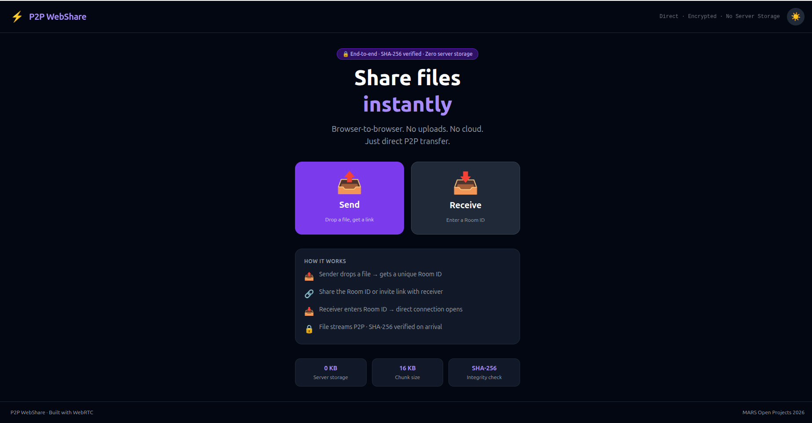
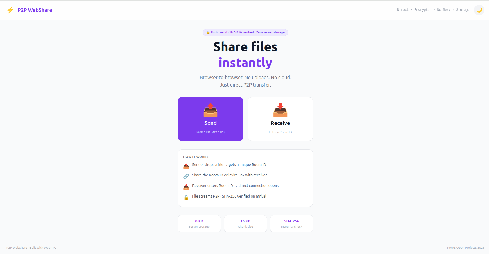
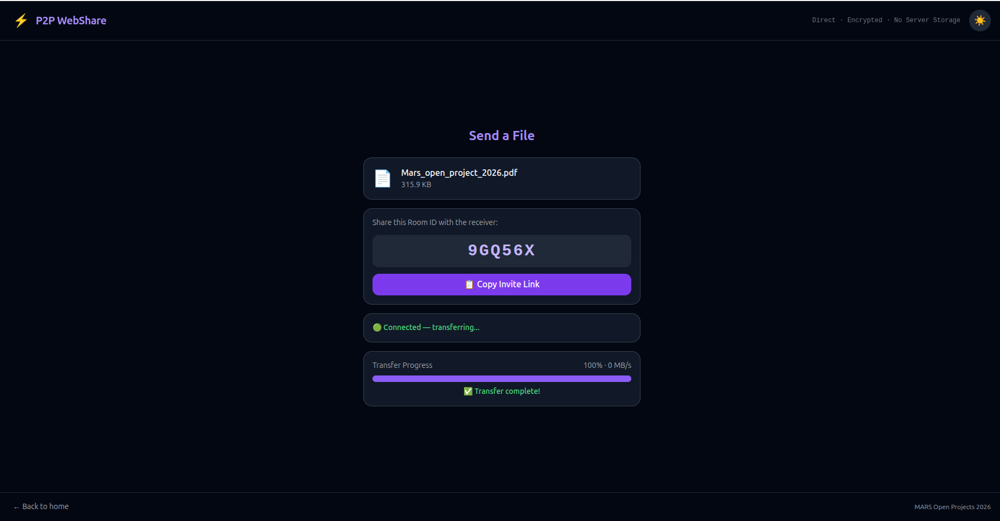
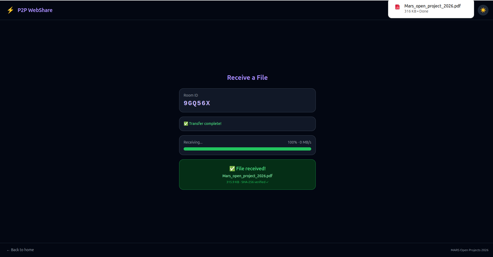

# ⚡ P2P WebShare

> Direct browser-to-browser file sharing via WebRTC. No uploads. No cloud. No server storage.

[](https://developer.mozilla.org/en-US/docs/Web/API/WebRTC_API)
[](https://react.dev)
[](https://nodejs.org)
[](https://socket.io)

---

## 🚀 Live Demo
---

## 📸 Screenshots

### 🌙 Dark Mode


### ☀️ Light Mode  


### 📤 Sending a File


### 📥 Receiving a File



---

## ✨ Features

### Core MVP
- 📤 **Drag & drop** file selection with 50MB limit enforcement
- 🔗 **Unique Room ID** generation + one-click invite link copy
- ⚡ **Direct P2P transfer** via WebRTC Data Channels — signaling server never touches the file
- 🔒 **SHA-256 integrity verification** — file hashed before sending and verified on arrival
- 📊 **Real-time progress** — transfer percentage + live speed (MB/s)
- 📥 **Auto-download** — file saves automatically when transfer completes
- ⚠️ **Graceful disconnect handling** — clean UI notification + retry button if either peer drops
- 🔗 **Invite link support** — Room ID auto-fills when receiver opens the shared link
- 🌙 **Dark / Light mode** — toggle with persistent preference via localStorage

---

## 🏗️ Architecture
[Sender Browser] ─────── WebRTC Data Channel (direct P2P) ──────► [Receiver Browser]

│                                                                    │

└──────────────── Socket.io (signaling only) ──────────────────────┘

│

[Node.js Server]

(never sees file data)

### How the handshake works
1. Sender creates a room → signaling server registers the room ID
2. Receiver joins room → signaling server notifies sender
3. Sender creates WebRTC **offer** (SDP) → relayed via signaling server
4. Receiver creates WebRTC **answer** (SDP) → relayed back
5. **ICE candidates** exchanged via signaling server for NAT traversal
6. Direct P2P connection established → signaling server is no longer involved
7. File chunked into 16KB pieces, SHA-256 hashed, streamed over data channel
8. Receiver reassembles chunks, verifies hash, auto-downloads

---

## 🛠️ Tech Stack

| Layer | Technology | Purpose |
|-------|-----------|---------|
| Frontend | React.js 18 + Vite | UI framework |
| Styling | Tailwind CSS (CDN) | Utility-first styling + dark mode |
| P2P Communication | WebRTC DataChannel API | Direct file streaming |
| File Integrity | Web Crypto API (SHA-256) | Zero-corruption guarantee |
| File Reading | FileReader API | Chunk-based file reading |
| Signaling Backend | Node.js + Express + Socket.io | WebRTC handshake coordination |
| Hosting (Frontend) | Vercel | Static frontend deployment |
| Hosting (Backend) | Render | Signaling server deployment |

---

## 📁 Project Structure
p2p-webshare/

├── client/                        # React frontend (Vite)

│   ├── index.html                 # Tailwind CDN + dark mode init script

│   ├── src/

│   │   ├── App.jsx                # Root component, routing, dark/light mode

│   │   ├── socket.js              # Singleton Socket.io client

│   │   ├── components/

│   │   │   ├── Sender.jsx         # File selection, Room ID display, progress UI

│   │   │   └── Receiver.jsx       # Room join, receive progress, download UI

│   │   └── hooks/

│   │       └── useWebRTC.js       # Core WebRTC logic, chunking, SHA-256

│   ├── eslint.config.js

│   └── package.json

├── server/

│   ├── index.js                   # Signaling server (Socket.io)

│   └── package.json

├── .gitignore

└── README.md

---

## ⚙️ Local Setup

### Prerequisites
- Node.js v18+
- npm v9+

### Steps

```bash
# 1. Clone the repository
git clone https://github.com/YOUR_USERNAME/p2p-webshare.git
cd p2p-webshare

# 2. Install server dependencies
cd server && npm install

# 3. Install client dependencies
cd ../client && npm install

# 4. Start the signaling server (Terminal 1)
cd server
node index.js
# → Signaling server running on http://localhost:3001

# 5. Start the frontend dev server (Terminal 2)
cd client
npm run dev
# → Frontend running on http://localhost:5173

# 6. Open http://localhost:5173 in your browser
```

---

## 🔄 Usage

### Sending a file
1. Open the app → click **Send**
2. Drag & drop a file (≤ 50MB) or click to browse
3. A **Room ID** is generated automatically
4. Click **Copy Invite Link** and share it with the receiver
5. Wait for receiver to join — transfer starts automatically

### Receiving a file
1. Open the invite link (Room ID auto-fills) OR open the app → click **Receive** → enter Room ID
2. Click **Join Room**
3. File transfers directly from sender's browser
4. Download triggers automatically once transfer is complete and SHA-256 verified

---

## 🔒 Security

| Property | Implementation |
|----------|---------------|
| Server never reads file | File data only flows over WebRTC DataChannel (P2P) |
| File integrity | SHA-256 hash computed by sender, verified by receiver |
| No storage | Signaling server holds only room metadata in memory, deleted on disconnect |
| Ephemeral rooms | Rooms are cleaned up immediately when either peer disconnects |

---

## 📊 Performance

| Metric | Value |
|--------|-------|
| Chunk size | 16 KB (optimal for WebRTC DataChannel) |
| Max file size | 50 MB (browser RAM constraint) |
| Speed display | Live MB/s updated every 500ms |
| Hash algorithm | SHA-256 via Web Crypto API (hardware-accelerated) |

---

## 🧪 Edge Cases Handled

- ✅ Wrong Room ID → "Room not found" error + Try Again button
- ✅ Sender closes tab mid-transfer → Receiver notified with Back to Home button
- ✅ Receiver closes tab mid-transfer → Sender notified with Back to Home button  
- ✅ File corruption → SHA-256 mismatch detected, download blocked
- ✅ Invite link → Room ID auto-fills in Receiver input
- ✅ Buffer overflow → Flow control via `bufferedAmountLowThreshold`

---

## 🙏 Acknowledgements

- [WebRTC API — MDN](https://developer.mozilla.org/en-US/docs/Web/API/WebRTC_API)
- [Web Crypto API — MDN](https://developer.mozilla.org/en-US/docs/Web/API/Web_Crypto_API)
- [Socket.io Documentation](https://socket.io/docs/)
- Built for **MARS Open Projects 2026** — Models and Robotics Section